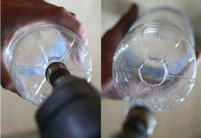
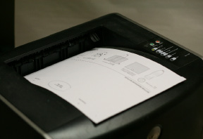
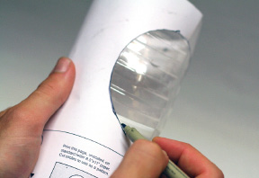
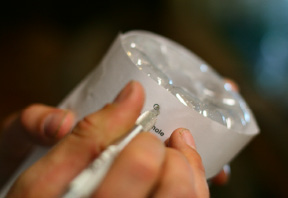
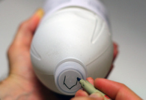
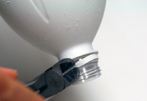
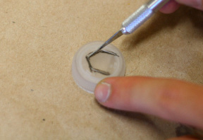
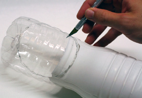
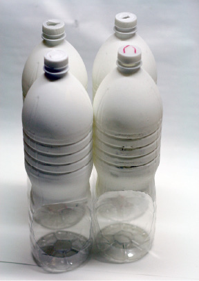
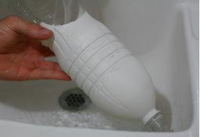

[&larr; Overview](index.md)

## 2. Plant Bottles

Tools/Materials needed for this step:
Tools: 1" (2.5 cm) diameter hole saw, marker, razor blade with fresh blade(s)
Materials: (4) 1.5 liter bottles

1. Gather the 4 bottles that were masked from the waist to the base. These are your Plant Bottles. Using 1" diameter drill bit, drill a hole in the bottom of each bottle. Go slow and steady when drilling so that the bottle will not collapse. It will take approximately 20-30 seconds before the bit will pierce the plastic.

    

2. Download and print the bottle cutting templates. Print them unscaled on a letter-sized piece of paper. It is a pattern for the Plant Bottles. Follow the directions on the sheet as to how to mount it to the bottle.

    

3. Trace the Plant Hole onto the bottle.

    

4. While the paper pattern is still on the bottle, mark and poke the Suspension Holes in the side of each bottle near its base using a sharp razor.

    

5. Mark the Cap Flap with its direction facing away from each Plant Hole, towards the rear of the bottle. Use the paper template to help align the direction of the Cap Flap.

    

6. Remove the cap and remove cap lock ring with scissors, razor blade, or snips.

    

7. Cut the Cap Flap with a sharp razor. Replace the cap on the bottle.

    

8. Using a sharp razor blade, cutout the Plant Hole.

    

9. Repeat the prior steps on the other bottles: Marking and cutting the Plant Hole, poking the Suspension Holes, removing the cap lock ring, and cutting the Cap Flap.

    

10. Flush all bottles with water.

    
