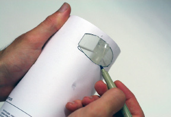
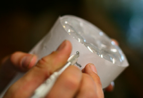
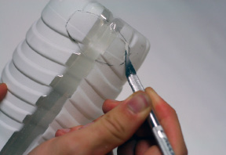
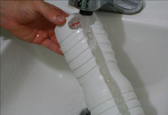

[&larr; Overview](index.md)

## Reservoir Bottle

Tools/Materials needed for this step:
Tools: 1" (2.5 cm) diameter hole saw, marker, razor blade with fresh blade(s)
Materials: (1) 1.5 liter bottle

1. Find the bottle that was masked from the bottom to top with a 1" (2.5 cm) band. This is your Bottom Reservoir Bottle. Using 1" (2.5 cm) diameter drill bit, drill a hole in the bottom of the bottle. Go slow and steady when drilling so that the bottle will not collapse. It will take approximately 20-30 seconds before the bit will pierce the plastic.

    

2. Download and print the bottle cutting templates. Print them unscaled on a letter-sized piece of paper. It is a pattern for the Bottom Reservoir Bottle. Follow the directions on the sheet as to how to mount it to the bottle.

    

3. Trace the Water Hole onto the bottle.

    

4. While the paper pattern is still on the bottle, mark and poke the Suspension Holes in the side of each bottle near its base using a sharp razor.

    

5. Using a sharp razor blade, cutout the Water Hole.

    

6. Flush the bottle with water.

    
