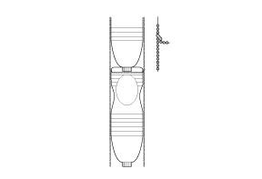
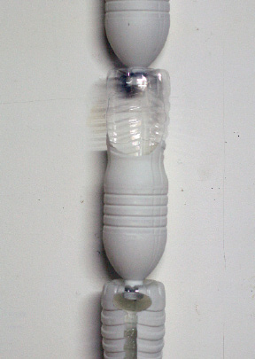
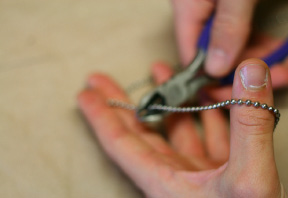
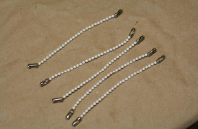
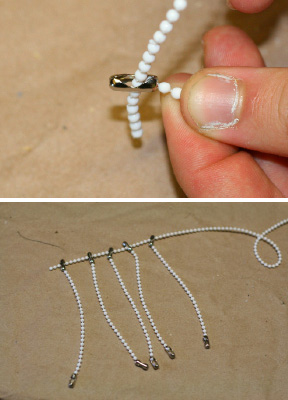
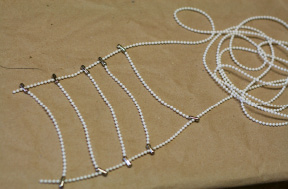
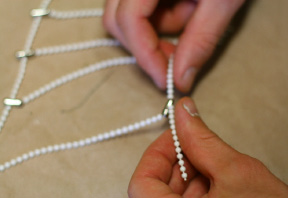
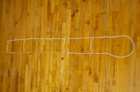

[&larr; Overview](index.md)

## 4. Suspension System

### Tools

* measuring tape
* wire snips

### Materials

* Bead Chain
* Bead Chain Couplers

***

1. You can use other materials like string to hang your windowfarm cheaper. Bead chain is much easier to take on and off for cleaning, is stable, easy to adjust, modular and makes a great tube cleaner for algae buildup too.

    

2. Daisy-chain all 5 bottles by removing each cap and screwing the mouth through the hole drilled in the base of the one below it. Align all the Plant Holes and Water Hole (in the bottom reservoir bottle) in one direction

    

3. Re-attach the caps to the bottles, making sure the Cap Flap is pointing away from each Plant Hole. The idea of the Cap Flap is to direct the dripping water away from the Plant Hole of the bottbelow. Set aside the column of bottles.

    

4. Measure and cut one 126" (320 cm) length of bead chain

    

5. Measure and cut 5 (five) 4.75" (12 cm) lengths of bead chain. Add a bead chain coupler to each end

    

6. Gather all 4.75" (12 cm) pieces with bead chain couplers on the ends. Take one end of the 126" (320 cm) chain, and thread it through the center holes of the bead chain couplers on one side of the 4.75" (12 cm)pieces. The seams of the bead chain coupers should be facing away from the end of the chain.

    

7. Repeat the process for the other side of the 126" (320 cm) chain and the couplers on the other side of the 4.75" (12 cm) pieces.

    

8. Starting a few inches from the ends of the 126" (320 cm) chain, space and snap-in-place the end couplers at 11.5" (29 cm) intervals.

    

9. Do this on both sides of the 126" (320) cm) chain.

    

10. You will end with a ladder effect.

    
