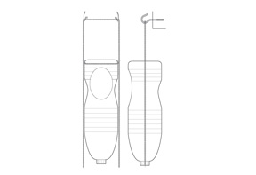
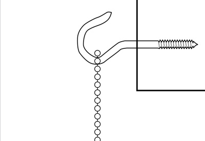
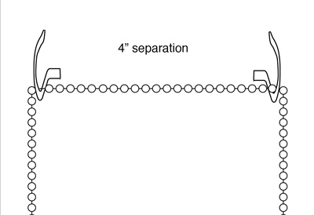
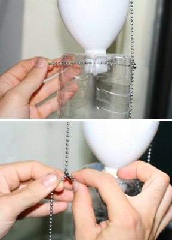

[&larr; Overview](index.md)

## 5. Mounting & Installation

### Tools

* measuring tape
* drill

### Materials

* (2) Cup Hooks

***

1. For each column of bottles, put two cuphooks into the wall above the window, spaced 4" (10 cm) apart.

    

2. Hang the bead chain ladder on the hooks, with the looped end at the top.

    

3. Merge the bottle column with the suspended chain by uncoupling one side of each of the horizontal 4.75" (12 cm) pieces and feeding it through each bottle's Suspension Holes.

    

4. Once fed through, recouple the horizontal bead chain piece. You may have to spend some time adjusting the system to get it straight. Your system should now be suspended.

    
