[&larr; Overview](index.md)

## 6. Plumbing System

### Tools

* Tape measure
* marker
* scissors
* needle nose pliers
* hacksaw or razor blade
* fine grit sand paper

### Materials

* Rigid Tubing
* Flexible Vinyl Tubing
* Check Valve
* Poland Springs "sports" drinking cap
* Metal inflation needle
* Presta stem
* Sealing washers
* Plant tape

***

1. Mark the rigid tube with a marker to create three lengths: 28.5 inches (72.4 cm) 28.5 inches (72.4 cm) 3 inches (7.6 cm)

    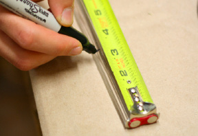

2. Score the rigid tube at the marks with a razor blade and snap, or use hacksaw to cut at the marks.

    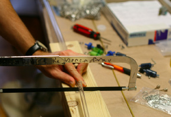

3. If necessary, lightly sand ends of tubes to remove debris from sawing.

    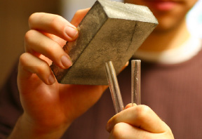

4. Mark flexible tube with a marker to create two lengths: 1 inch (2.5 cm) 7 inches (17.8 cm)

    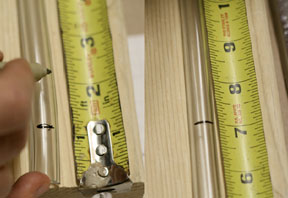

5. Cut the flexible tube at the marks with scissors.

    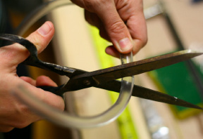

6. Attach the 3" (7.62 cm) rigid tube piece to one end of the 7" (17.8 cm) flexible tube. Overlap the pieces by 1/2" (1.2 cm).

    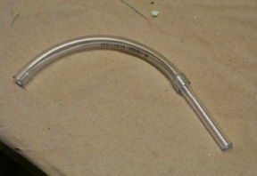

7. Attach the other end of the 7" (17.8 cm) flexible tube to one end of one 28.5" (72.4 cm) rigid tube. Overlap pieces by 1/2" (1.2 cm).

    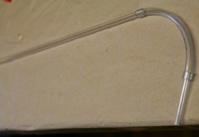

8. Use the 1" (2.5 cm) flexible tube join the two 28.5" (72.4 cm) rigid tubes.

    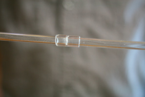

9. Measure and cut 2 (two) 12" (30.5 cm) pieces of plant tape.

    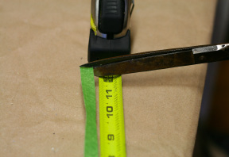

10. Stick one end of the tube assembly into the Water Hole of the bottom bottle in the suspended system.

    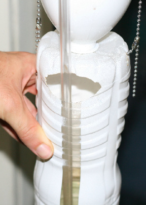

11. Stick the flexible end of the tube assembly to into the hole of the top bottle. Use the plant tape to wrap the top bottle near the waist, capturing and securing the water tube to the top bottle. Use a zip-tie through the back side of the bottle to point the outlet of the tube towards the rear of the bottle.

    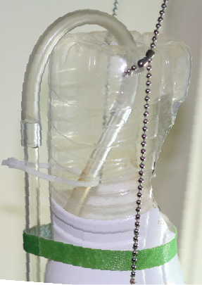

12. Use the second piece of plant tape to secure the tube assembly to the middle bottle near the tube assembly's midway joint.

    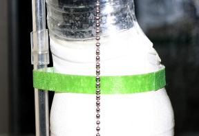

13. Bottom Cap Assembly We have provided two methods for Do-It-Yourself assembly of the bottom cap depending on the size of check valve you received with your pump. Use the image on the right as a reference to find our which Method to use to construct the bottom cap. If you have the larger 0.8" (2.03 cm) diameter check valve (check valve on the left) then use Method A. If you have the smaller 0.6" (1.52 cm) diameter check valve (check valve on the right), or any other check valve, use Method B or Method C.

    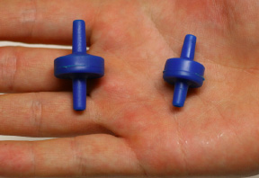

14. Method A With needle nose pliers, remove the filter in the hole of the sports cap, making an unobstructed hole.

    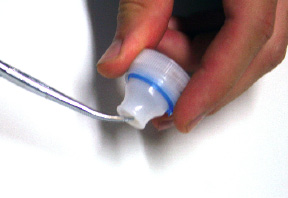

15. Check to make sure the check valve is operational. Blow through one end, then the other. It should only allow air to pass through in one direction. If air can pass through in both or no directions, PetCo has provided you with a faulty valve. Please contact them to get a replacement check valve. Attach a metal inflation needle to the outlet stem of the check valve. (It says "OUT" on the valve). Align it first with your fingers, then use pliers to screw down the valve with hard pressure. The threads inside the metal inflations needle should dig into the plastic of the check valve's stem.

    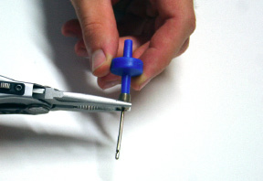

16. Stick the air hose included with the PetCo pump through the end of the cap and attach with the inlet end of the check valve.

    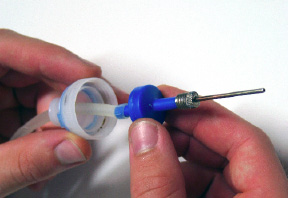

17. Seat the check valve securely inside the cap.

    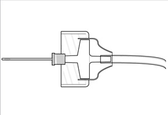

18. With even, firm pressure, screw the cap into the bottle with your hand. Insert the water tube assembly over the top of the air needle. Screw the cap assembly onto the bottle with your hand. Insert the water tube assembly over the top of the air needle. The water tube should be seated as far down over the metal inflation needle as possible, and will be at an angle. This angle creates a very important gap to allow water to enter the tube. Attach the other end of the air hose to the pump's outlets.

    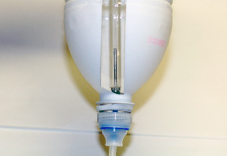

19. Method B This method requires additional parts: a Presta threaded longstem bicycle inner tube (with stem washer), and two 1/4" ID 1/2" OD sealing washers. Drill a 1/4" (6.2 mm) hole in the center of the bottom bottle's cap.

    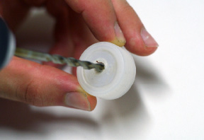

20. With a hacksaw, cut the valve off of the rubber tube near its base.

    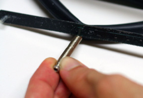

21. With pliers, remove the valve at the top of the stem.

    

22. Take the presta stem and face the tapered end to the right. Slide one sealing washer on to it with the rubber side facing to the right.

    

23. Next slide on the cap, with the inside facing to the right.

    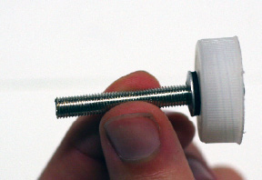

24. Next, slide on another sealing washer, with the rubber side facing to the left.

    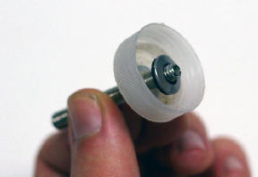

25. Next, attach the metal inflation needle to the threaded tapered end of the presta stem. Using pliers, tighten as tight as possible.

    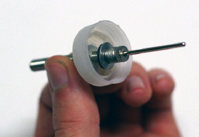

26. Next, thread-on the presta stem washer from the opposite end, and use it to tighten the entire assembly. Use pliers to tighten the assembly as tight as possible.

    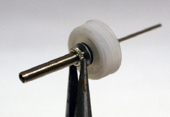

27. Attach a 1" (2.5 cm) length of air hose included with the PetCo pump to the end of the threaded Presta stem, followed by the check valve. Attach the other end of the air hose to the PetCo pump's outlets.

    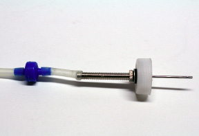

28. Screw the cap assembly onto the bottle with your hand. Insert the water tube assembly over the top of the air needle. The water tube should be seated as far down over the metal inflation needle as possible, and will be at an angle. This angle creates a very important gap to allow water to enter the tube. Attach the other end of the air hose to the pump's outlets. IMPORTANT: The water tube MUST be seated over the air needle, with the air needle as far inside the water tube as possible. If you don't do this, no water will flow in the water tube, and instead air will bubble in the bottom bottle reservoir. Read more at the bottom of this page.

    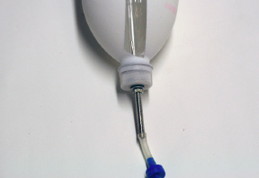

29. Method C This method requires additional parts: A double-barbed 0.170" to 0.170" plastic threaded bulkead with nut (available from industrialspec.com) per column. One 1/4" ID 1/2" OD sealing washer, per column. Find the cap for the bottom bottle. Drill a 1/4" diameter hole in the center of the bottom bottle reservoir cap. If there is already a hole in the cap, make sure it is 1/4" in diameter (you may need to enlarge it). Remove any rough edges in necessary.

    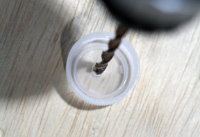

30. Slide the sealing washer into the threaded shaft of the bulkhead, leading with the metal side of the washer.

    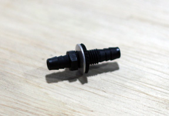

31. Stick the bulkhead/needle assembly into the cap through its 1/4" hole. Once fully seated, the threads of the bulkhead should be on the outside of the cap and the rubber sealing washer on the inside of the cap should be touching the inside surface of the cap.

    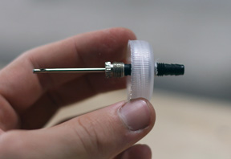

32. Next, add the plastic nut and tighten as much as possible. Consider using small pliers to help create a tight seal.

    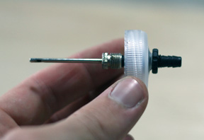

33. Using a short length of 3/16" ID flexible airline tubing, attach the outside end of the bulkhead to the outlet end of the check valve. Blow in the checkvalve to verify its direction. You should be 'blowing into the cap'.

    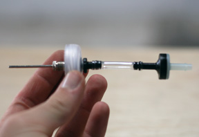

34. At the bottom bottle, insert the water tube assembly over the top of the air needle.

    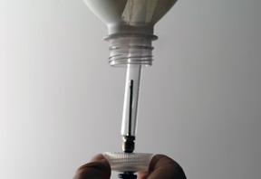

35. Screw the cap assembly onto the bottle with your hand. The water tube should be seated as far down over the metal inflation needle as possible, and will be at an angle. This angle creates an important gap to allow water to enter the base of the tube. IMPORTANT: The water tube MUST be seated over the air needle, with the air needle as far inside the water tube as possible. If you don't do this, no water will flow in the water tube, and instead air will bubble in the bottom bottle reservoir. Read more at the bottom of this page.

    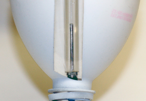

36. Connect the other end of the check valve to one end of the 2.5' lengths of airline tubing

    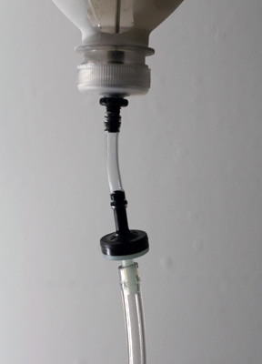

37. Connect the other to one of the pump's outlets.

    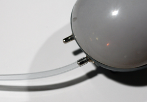

38. Troubleshooting the flow of water:

    1. Seat your tube. The base of the water tube needs to be completely seated over the top of the air needle. This means you want the tip of the air needle as deep inside the water tube as possible, creating at least a 1 inch 'overlap' between the tip of the needle (where the air bubbles are released) and the base of the tube (where the water enters the tube). This distance helps prevent the air bubbles from escaping. You may need to use tape or the plant strips to keep the base of the water tube seated, preventing it from 'scooting up' and reducing your overlap distance. NOTE: You do not want the base of the water tube to be completely obstructed by the air needle. Doing so would not allow water to enter the tube! There should be a small gap at the base of the water tube that allows water to enter the base of the tube.

    2. Keep the water high - Keep the water level in your bottom bottle reservoirs high. As the water level drops in the bottom bottles, the pressure on the water column reduces. This situation increases the likelyhood of air bubbles escaping from the base of the water tube instead of traveling up inside of it!

    3. Adjust your pump - A proper air flow rate is critical to provide enough force to carry water up the water tubes. If the air flow rate is too low, the air flow will not be strong enough to overcome the weight of the water in the tube. In this case, and no water will travel up the tube and instead the bubbles will escape from the bottom of the water tube. To adjust the output rate of the air bubbles, use the knob on top of your pump. NOTE: There are factors that influence the required power setting of the pump, including: - The length of the airline tube running between the pump and the bottom bottle. Shorter lines are more efficient and will generally require a lower power setting. Avoid having significantly different lengths of airline running to the same pump.

    4. Straighten your water tube - Maintaining a straight, vertical, plumb water tube is critical to efficient water flow up the tube. Use tape and/or the plant tape strips to straighten the tube.
