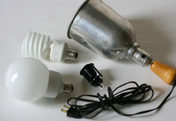
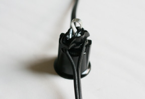
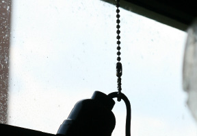

[&larr; Overview](index.md)

## 7. Adding Lights

### Tools

* measuring tape
* snips
* drill

### Materials

* (2) CFL bulbs (full color spectrum)
* (1) cup hook
* (1) lamp socket on wire, (1) lamp pin socket, 18" (46 cm) bead chain 

***

1. Start with a corded clip light and remove the shade. Consider using CFL bulbs with plastic domes to help prevent shattering of the bulb against your window.

    

2. Next, mount the pin socket to the cord, 2 feet (61 cm) down from the light socket end.

    

3. Screw a cup hook at the center of two WindowFarms columns. If your window sill has depth, mount the lights as close to the glass pane as possible. Using 18" (46 cm) of bead chain coupler, loop the bead chain around the lamp cord near the base of the lamp socket. Suspend the light column assembly from the cup hook.

    
