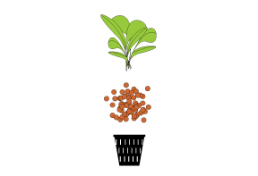
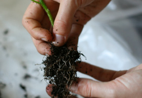
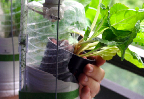

[&larr; Overview](index.md)

## 8. Adding Plants

### Materials

* Hydroton clay pellets
* Plastic net cups
* Plants

***

1. If using plants that were grown in soil, start by shaking-out the soil thoroughly.

    

2. Put each plant in a netcup with clay pellets.

    

3. Install your plants into the WindowFarm by sliding it through the plant hole. Please visit our web community for recommendations on plant placement: http://our.windowfarms.org

    
