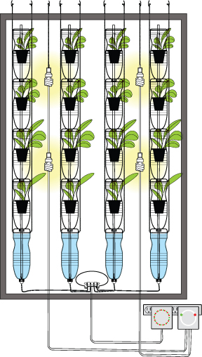

[&larr; Overview](index.md)

## Full Assembly

Tools/Materials needed for this step:

1. WindowFarm columns can be mounted side-by-side in a window. Each light column can supply light to two WindowFarm columns. Both the lights and the pump can be on different timers. Create a "drip loop" with all electrical wires to prevent any leaking water from running into the electrical outlets.

    
